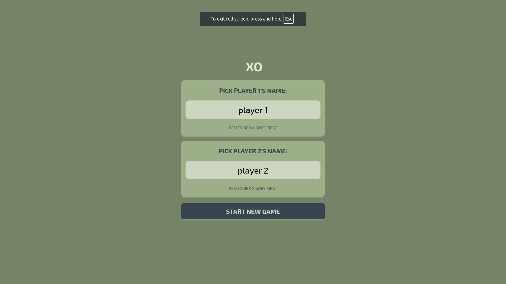
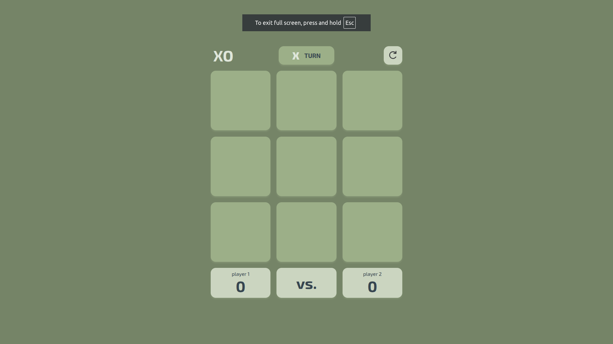
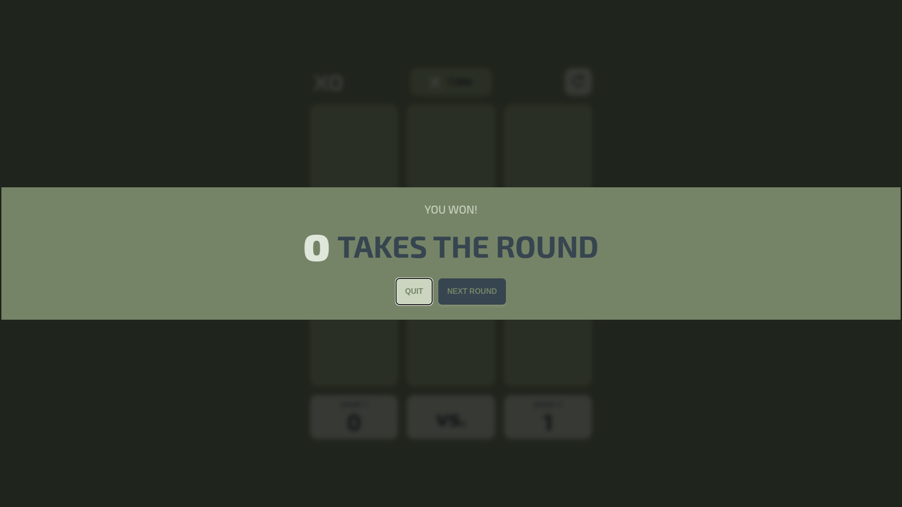
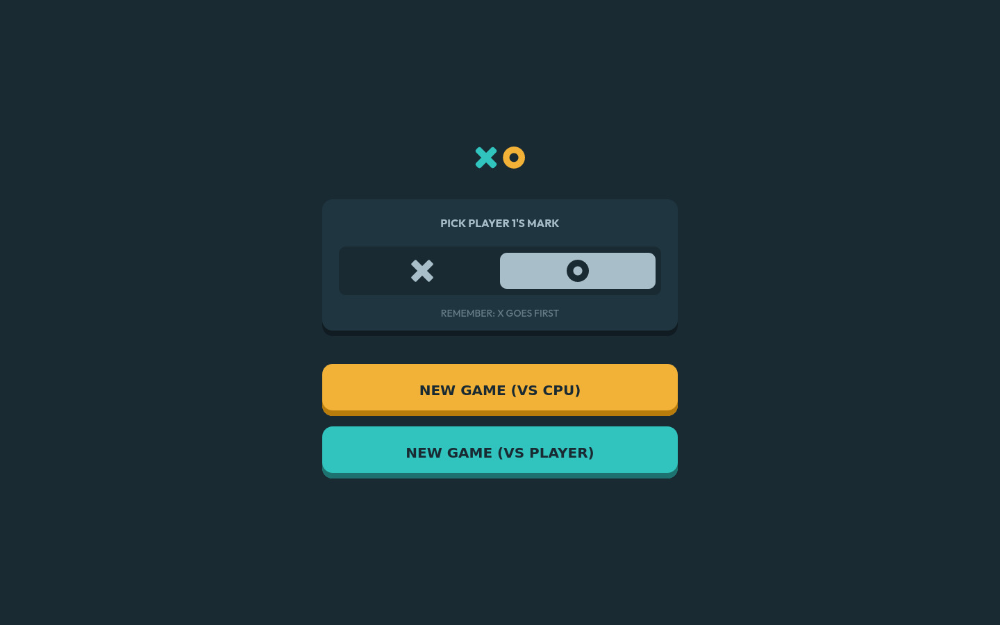
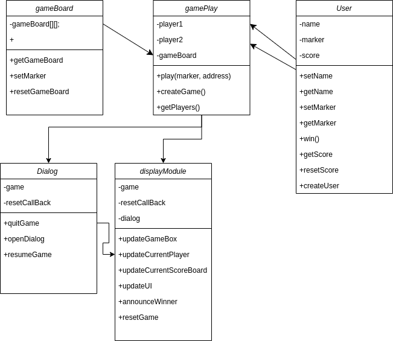

# odin-tic-tac-toe

###  Time Taken: 12-hr approx.
Part of The Odin Project. Here is the [link](https://www.theodinproject.com/lessons/node-path-javascript-tic-tac-toe) to TOP project description.

## [LIVE-PREVIEW](https://leedae308.github.io/odin-tic-tac-toe/)
Here is the screenshot of working website:

Design Ideas came from:

<strong> HTML, CSS, JS</strong> project. 100% Custom-codded.

## NEW Skill Tools Used:
JS: DOM, Module Design, object oriented design, local-storage;

## Class Diagram

Workes 100% as intended.
### Future Improvments: 
Adding play against AI option. 

